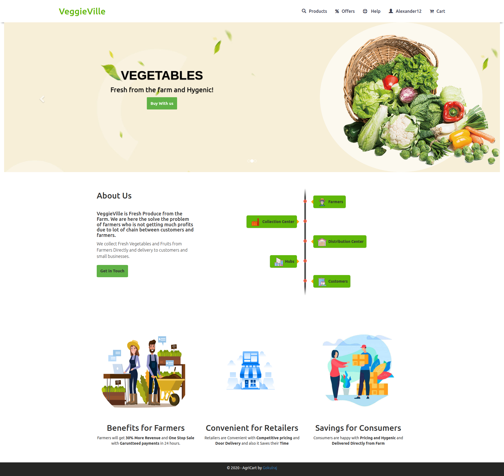
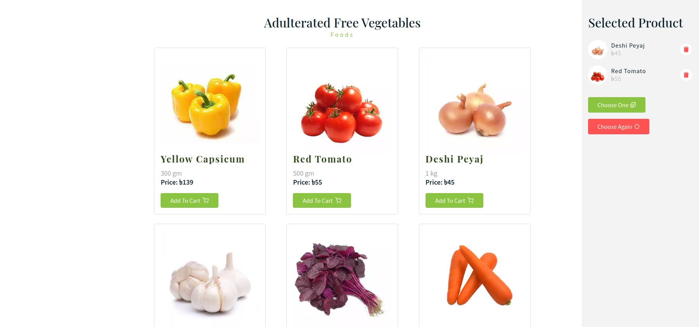

<h2 align="center">
  VeggieVille Online Vegetable shopping Website 
  <a href="https://github.com/AlexanderCruciata" target="_blank">AlexanderCruciata</a>
</h2>

This Project is Online shopping for grocery (Vegetables and fruits ) fresh from farmers which is build using Reactjs and backend as Firebase Cloud, featuring a user-friendly interface, essential functionalities like user registration, login, shopping cart. The platform is built on the React.js framework and employs technologies such as CORS, Axios, and Mongoose.

  

  

 

## Built With

This project was built using these technologies.

- React.js
- Firebase
- CSS3
- Axios

## 🛠 Installation and Setup Instructions

1. Installation: `npm install`

2. In the project directory, you can run: `npm start`

Runs the app in the development mode.\
Open [http://localhost:3000](http://localhost:3000) to view it in the browser.
The page will reload if you make edits.

### Show your support

Give a ⭐ if you like this website!